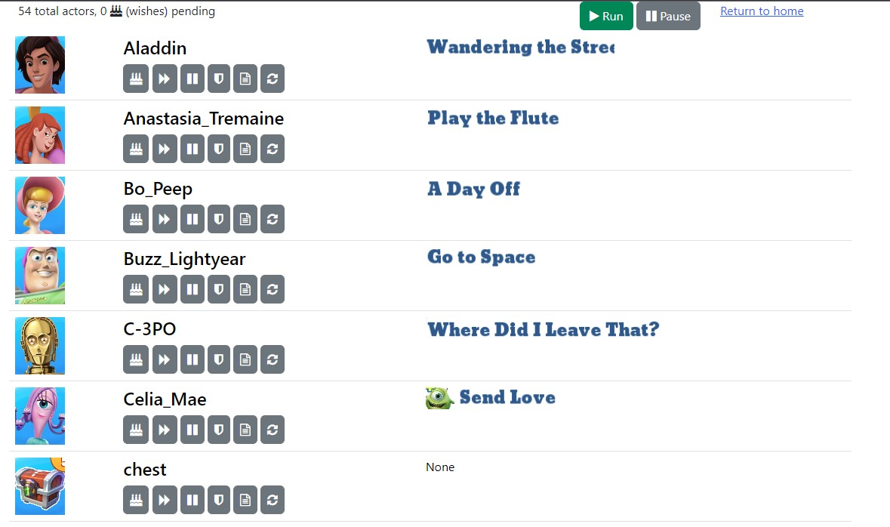

An OpenCV automation bot for controlling the mobile game Disney's Magic Kingdoms through the Windows Store version of the app. The "keyboard hint" graphics option must be on for the bot to assign tasks properly.

* Assigns new activities to each actor (character) every time they complete an activity
* Collects Magic / Event Currency (EC) / Gold / Tokens from attractions and concessions
* Watches Ads when they are available
* Collects calendar, finding gold, milestone, daily/weekly rewards, daily bronze/silver chests
* Trigger attraction wishes and collect happiness
* Stepping through quest completion chat bubbles and high-fiving the actors when needed
* Automatically add new actors as they are encontered
* Scrape the [Disney Magic Kingdoms Wiki](https://dmk.fandom.com/) for actor action rewards

While running a webui is created at http://127.0.0.1:5000/ to allow remote monitoring and management of the actor tasks. Clicking on the screenshot sends a click to the game and refreshes the image.

The buttons in the webui correspond to the following actions, in this priority order:

* ClipAll - Attempt to get screenshots of all the available tasks for an actor
* Skip - Do not assign a task to the actor
* Pause - Stop all execution when the actor becomes idle
* Wish - Attempt to assign the actor to perform a characer wish activity (using happy icon)
* Kingdom Quest - Attempt to assign the actor to perform a Kingdom Quest activity (using castle icon)
* Event Quest - Attempt to assign the actor to perform a Event Quest activity (using scroll icon)

Actions are peformed by the bot in this order:

* Check for "standalone clicks" such as event completion checkmarks, happy icons, claim buttons, swipe/tap prompts, levelups. Multiple standalone clicks of different types can be performed per loop, and only the top 3/4 of the screen is checked (to avoid clicking the active event box by mistake).
* Perform "periodic clicks" for things that can pop up over the game field or other things that don't need to be checked very frequently. This includes closing the fsking ad popups, errant dialogs, reward streaks, enchant complete, character levelups, etc.
* If neither of those happened for a short time, check for an actor portrait in the top left (by seeing the TAB bubble on the bottom of it)
  * If there is a checkmark on it, click and return, letting a standalone click collect it
  * If no checkmark, search the actor database for a matching actor and assign the target task
  * If none of that, check for a quest tickle (exclamation mark) to start/continue a quest
  * If none of that happened for a while but the button is still active, possibly create a new actor
* If nothing has happened in a while, randomly move in a direction, or restart the game app if it has been more than 4 hours (as the frame rate really goes down over time)

### Installing

Requires a Python venv. I'm running Python 3.9.10. Install the requirements using `pip install -r requirements.txt` then run using `flask run` from this directory.

